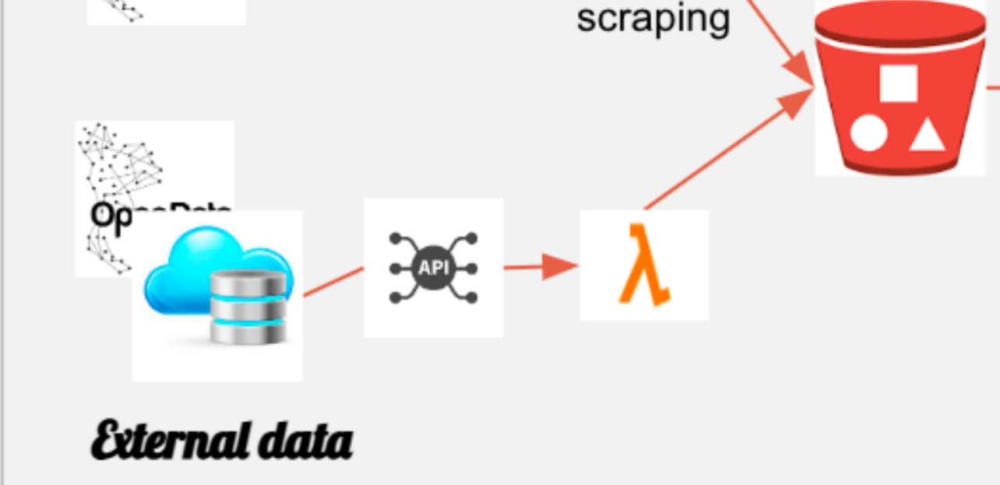

# plf_clac_open_data

## Présentation


Cette lambda permet de récuperer les données d'un dataset  en interrogeant l'API correspondante puis de les écrire dans un bucket S3. 

La lambda prend et renvoie un fichier JSON.

<p align="center">
    
</p>

## Utilisation

### Prérequis

Terraform ~1.5 

- Voir: [Installation Terraform](https://developer.hashicorp.com/terraform/tutorials/aws-get-started/install-cli)

Python ~3.10 

### Terraform

#### Lancement: déploiement de la lambda et création bucket S3

```sh
cd Terraform/
```

Initialisation de terraform

```sh
terraform init
```

Définition des variables dans poc.terraform.tfvars.
Le nom final du bucket est sous le format "bucket_name"-"environment" 

**Changez la variable bucket_name en conséquent dans LambdaOpenData/lambda_function.py**

Par défaut:

```
acl_value   = "private"
region      = "eu-west-3"
environment = "poc"
bucket_name = "vwis-open-data"
```

Plan d'éxecution du terraform

```sh
terraform plan -var-file poc.terraform.tfvars
```

Lancement du terrafom

```sh
terraform apply -var-file poc.terraform.tfvars
```

#### Mise à jour Lambda et Bucket S3 avec terraform

```sh
terraform taint null_resource.pip_install
terraform apply -var-file poc.terraform.tfvars
```

### Utilisation Lambda

#### Syntaxe fichier JSON

```json
{
  "id": <String>,
  "url": <String>,
  "parameters": {
    "sample_size_limit": <int>, 
    "sort_criteria": <String> 
  }
}
```

+ id (Obligatoire): nom du fichier final dans le Bucket

+ url (Obligatoire): URL à interroger

+ parameters (Optionnel):

    + sample_size_limit: limite de la taille de l'échantillon. Max/Default: 10000

    + sort_criteria: critère de tri (spécifique à chaque dataset)

#### Sortie et erreurs

La lambda s'est executée normalement lorsque vous recevez le JSON suivant:

```json
{
  "statusCode": 200,
  "body": "Done"
}
```

Log associé:

```
<Dextr>: [INFO]: 2023-07-21 13:43:50,597 | Trace ID: 123456789 Span ID: None | Done succesfully in 6.78s
```

En cas d'erreur, un JSON contenant le code et le message d'erreur correspondant est renvoyé.

**Exemple de JSON et log d'erreur (requête erronée):**

```json
{
  "statusCode": 404,
  "body": "404 Client Error: Not Found for url: https://public.opendatasoft.com/pi/records/1.0/search/?dataset=covid19-france-livraison-vaccin-region&rows=10000&order_by=kan_code"
}
```
```
<Dextr>: [ERROR]: 2023-07-21 14:11:15,746 | Trace ID: 123456789 Span ID: 987654321 | API request failed: Error Code 404
```

